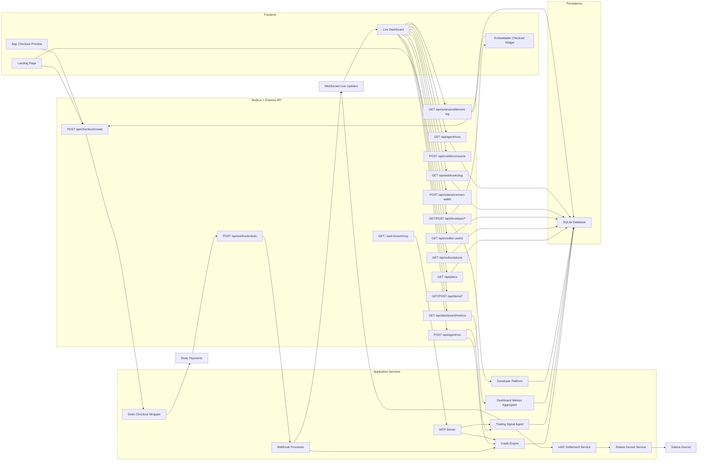
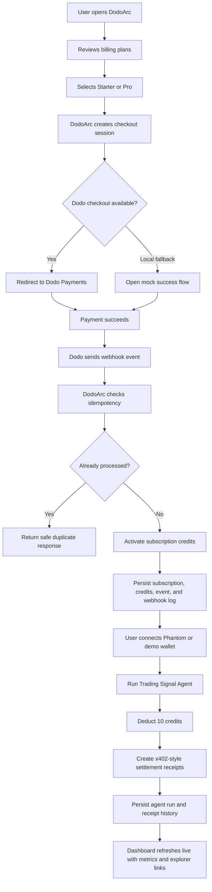
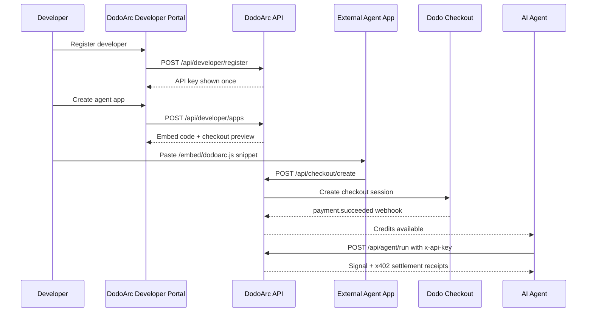
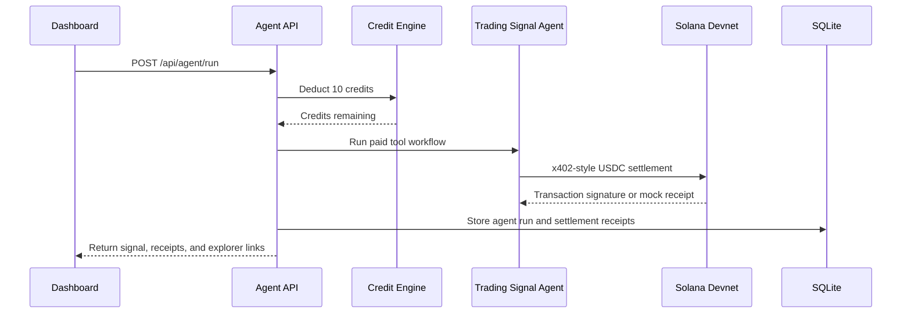
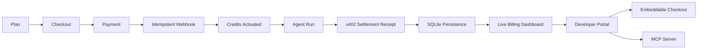

# DodoArc

DodoArc is a billing OS for AI agent products. It lets users subscribe through Dodo Payments, activates credits after payment, runs credit-backed AI agents, and gives operators a live dashboard for subscriptions, webhook activity, credit usage, agent runs, and Solana x402-style settlement receipts.

Built for the Dodo Payments track at the Solana Frontier hackathon, DodoArc starts with a practical wedge: human-to-agent billing first, with developer infrastructure for agent-operated payments.

## Milestone Status

### Milestone 1: Checkout and Credits

Milestone 1 proved the core billing loop:

- Plan discovery for an AI agent product.
- Dodo Payments checkout creation.
- Local mock checkout fallback for development.
- Payment webhook handling.
- Credit activation after successful payment.
- Dashboard visibility for subscription and credit state.
- Backend tests for credit and webhook behavior.

### Milestone 2: Persistent Billing Dashboard

Milestone 2 turned the MVP into a stronger product foundation:

- SQLite-backed persistence for users, subscriptions, events, webhook logs, and credit state.
- Dedicated landing page and authenticated-style dashboard surface.
- Webhook idempotency to prevent duplicate processing.
- Webhook processing logs for debugging and operational visibility.
- Solana settlement readiness endpoints for future stablecoin flows.
- Improved dashboard views for subscriptions, credits, events, webhooks, and settlement status.
- Expanded tests around webhook behavior and persistent billing state.

### Milestone 3: Agent Runs and x402 Settlement Receipts

Milestone 3 connects the billing foundation to the agent economy:

- Phantom wallet connect with demo wallet fallback for Solana devnet settlement routing.
- Demo Trading Signal Agent exposed through `POST /api/agent/run`.
- Credit deduction before each agent execution.
- Three paid tool calls per run, represented as x402-style USDC settlement receipts.
- Real Solana devnet transfer path when wallet credentials are configured.
- Mock settlement receipts when devnet credentials are absent, keeping the demo runnable.
- Persistent agent run history and settlement receipt storage in SQLite.
- Dashboard Agents view for running the agent, reviewing receipts, and opening Solana explorer links.
- Devnet setup helper for funding and checking the settlement wallet.

### Milestone 4: Live Operator Dashboard

Milestone 4 makes the demo and operator view judge-ready:

- Dashboard metrics backed by real SQLite state instead of static display values.
- Aggregated visibility for subscriptions, fiat revenue, credit usage, agent runs, and USDC settlement receipts.
- Revenue chart and credit usage views designed around live subscription and usage data.
- Real-time dashboard refresh path for webhook and agent-run updates.
- One-click demo flow that connects payment simulation, credit activation, agent execution, and settlement visibility.
- Flow visualization showing the complete DodoArc loop from user payment to Solana settlement.
- Loading, error, and empty states for a more reliable live demo experience.
- Dashboard test coverage around metrics, demo user setup, simulated payment, and credit usage updates.

### Milestone 5: Demo Readiness and Submission QA

Milestone 5 turns DodoArc into a repeatable hackathon demo:

- Production smoke test covering health, landing page, dashboard, plans, developer registration, app creation, demo user setup, simulated payment, agent run, settlement log, metrics, and MCP discovery.
- Environment validation script for checking Dodo, Solana, dashboard, and local demo configuration before recording or judging.
- Submission-ready local flow: landing page to dashboard, full demo run, settlement receipts, and operator metrics.
- `.env.example` updated with Dodo, Solana, database, dashboard, and smoke-test configuration.
- Test suite expanded to cover dashboard metrics and developer platform behavior.

### Milestone 6: Developer Platform

Milestone 6 moves DodoArc from a single-app MVP toward a platform for external AI agent builders:

- Multi-developer SQLite schema with developers, API keys, and developer apps.
- API key authentication for protected agent and credit consumption endpoints.
- Developer Portal in the dashboard for registration, API key generation, app creation, checkout preview, and embed code.
- Embeddable checkout widget served at `/embed/dodoarc.js`.
- Standalone app checkout pages at `/checkout/:appId`.
- MCP server and discovery endpoint for agent-native access to credits, usage, agent runs, settlements, and dashboard metrics.
- Dodo checkout verification script for testing live checkout creation when Dodo credentials and product IDs are configured.

## Architecture



## Workflow Map



## Developer Platform Flow



## Agent Settlement Sequence



## Tech Stack

- Node.js
- Express
- Dodo Payments SDK/API wrapper
- SQLite through `better-sqlite3`
- Solana Web3.js and SPL Token tooling
- WebSocket live dashboard updates through `ws`
- MCP server through `@modelcontextprotocol/sdk`
- Static HTML, CSS, and JavaScript
- Jest and Supertest

## Project Structure

```text
DodoArc/
|-- public/
|   |-- embed/dodoarc.js
|   |-- index.html
|   |-- landing.js
|   |-- dashboard.html
|   |-- dashboard.js
|   `-- mock-success.html
|-- scripts/
|   |-- check-env.js
|   |-- setup-devnet.js
|   |-- setup-dodo-products.js
|   |-- smoke-test.js
|   `-- verify-dodo-checkout.js
|-- src/
|   |-- config.js
|   |-- middleware/auth.js
|   |-- mcp/server.js
|   |-- routes/
|   |   |-- agent.js
|   |   |-- checkout.js
|   |   |-- credits.js
|   |   |-- demo.js
|   |   |-- developer.js
|   |   |-- metrics.js
|   |   |-- plans.js
|   |   |-- solana.js
|   |   |-- subscriptions.js
|   |   |-- webhook.js
|   |   `-- webhooks.js
|   `-- services/
|       |-- agent.js
|       |-- db.js
|       |-- dodo.js
|       |-- solana.js
|       `-- sqlite.js
|-- tests/
|   |-- agent.test.js
|   |-- credits.test.js
|   |-- dashboard.test.js
|   |-- developer.test.js
|   `-- webhook.test.js
|-- mcp.js
|-- server.js
|-- package.json
`-- .env.example
```

## Environment

Create a `.env` file from `.env.example` and add Dodo test credentials.

```env
PORT=3000
BASE_URL=http://localhost:3000
SMOKE_BASE_URL=http://localhost:3000
FRONTEND_URL=http://localhost:3000

DODO_PAYMENTS_API_KEY=dodo_test_your_key
DODO_PAYMENTS_WEBHOOK_SECRET=whsec_your_secret
DODO_PAYMENTS_ENVIRONMENT=test_mode
DODO_PRO_PRODUCT_ID=prod_your_pro_product_id

DB_PATH=./data/dodoarc.db
SOLANA_RPC_URL=https://api.devnet.solana.com
SOLANA_PRIVATE_KEY=
USDC_MINT_DEVNET=4zMMC9srt5Ri5X14GAgXhaHii3GnPAEERYPJgZJDncDU
SETTLEMENT_WALLET_PUBLIC_KEY=
X402_TOOL_PROVIDER_WALLET=
```

Use Dodo test mode while developing. Never commit production API keys or webhook secrets.

## Run Locally

```bash
npm install
npm run dev
```

Open:

```text
http://localhost:3000
```

Dashboard:

```text
http://localhost:3000/dashboard
```

## Test and Verify

```bash
npm test
npm run smoke
npm run check-env
```

Run the MCP server:

```bash
npm run mcp
```

Verify Dodo checkout configuration:

```bash
npm run verify-dodo
```

## Current Outcome



DodoArc now demonstrates a testable billing and developer-platform foundation for AI agent products: Dodo Payments checkout, webhook-based activation, durable billing records, credit-backed agent execution, x402-style Solana settlement receipts, live operator metrics, developer API keys, embeddable checkout, and MCP-native agent access.
