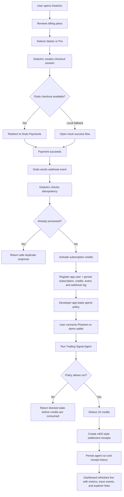
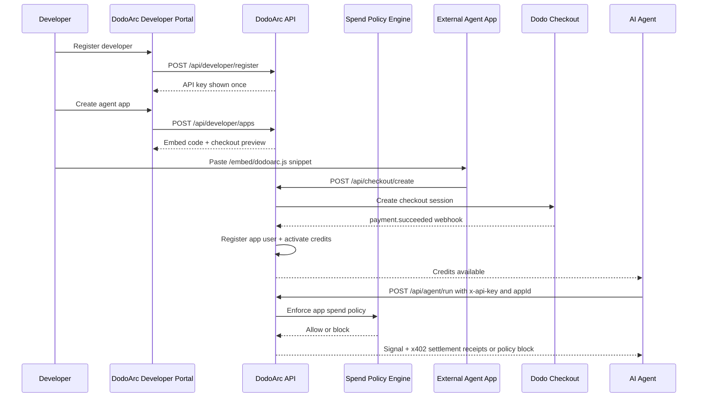
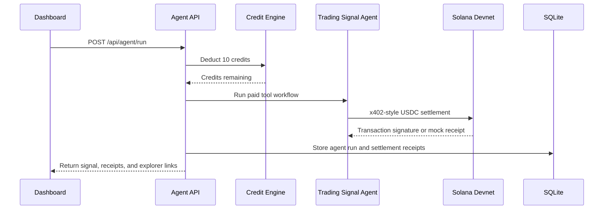
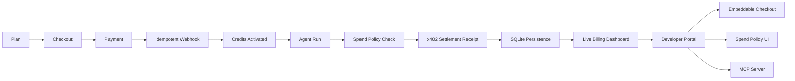

# DodoArc

DodoArc is the programmable spend-control layer for AI agent products. Human users pay with familiar fiat checkout, agents spend against app-defined policy, and every paid tool call can produce a verifiable settlement receipt on Solana.

## Problem

AI agents can now call paid tools, spend credits, and trigger real financial actions, but the billing stack around them is still incomplete.

- Users pay in familiar local rails like UPI and cards.
- Agents operate in API and crypto-native environments.
- Billing systems handle checkout, but not controlled agent spend after payment.
- Operators still lack a clear path from fiat payment to credits, agent execution, and settlement.

That leaves a missing layer between human payment and autonomous agent action.

## Solution

DodoArc connects familiar fiat checkout on the front end with policy-controlled agent execution on the back end:

- Human users pay through Dodo Payments using familiar rails.
- DodoArc activates credits and links the user to a developer app.
- Agents consume those credits only if the app policy allows the run.
- Every paid tool call can generate a verifiable USDC settlement receipt on Solana.
- Operators and developers get a live dashboard, webhook visibility, traceability, and app-scoped controls.

In short, DodoArc turns:

- `Fiat in`
- `Policy-controlled agent spend`
- `Solana settlement receipts out`

## What DodoArc Solves

- Lets non-crypto users pay for AI agent products with familiar local rails.
- Gives developers a control plane for app-level budgets and spending rules.
- Prevents unsafe agent runs before credits are consumed.
- Bridges offchain billing with onchain-verifiable settlement receipts.
- Makes the full payment-to-agent-to-settlement path observable for operators.

## What DodoArc Provides

- Dodo Payments checkout integration for human users.
- Credit activation and subscription tracking after successful payment.
- Multi-tenant developer apps with API keys and embeddable checkout.
- Per-app spend policies for pause/resume, daily caps, per-run caps, and approval thresholds.
- Agent execution with enforced credit deduction and policy checks.
- x402-style Solana settlement receipts for paid tool calls.
- MCP discovery for agent-native integration.
- Live dashboard visibility across subscriptions, credits, webhooks, agent runs, and settlements.

## Architecture

```mermaid
flowchart LR
    subgraph Frontend["Frontend"]
        Landing["Landing Page"]
        Dashboard["Live Dashboard"]
        Embed["Embeddable Checkout Widget"]
        AppCheckout["App Checkout Preview"]
    end

    subgraph API["Node.js + Express API"]
        Plans["GET /api/plans"]
        Checkout["POST /api/checkout/create"]
        Subs["GET /api/subscriptions"]
        Credits["GET /api/credits/:userId"]
        Consume["POST /api/credits/consume"]
        Webhook["POST /api/webhook/dodo"]
        WebhookLog["GET /api/webhooks/log"]
        Wallet["POST /api/solana/connect-wallet"]
        AgentRun["POST /api/agent/run"]
        AgentRuns["GET /api/agent/runs"]
        SettlementLog["GET /api/solana/settlement-log"]
        Metrics["GET /api/dashboard/metrics"]
        Demo["GET/POST /api/demo/*"]
        Developer["GET/POST /api/developer/*"]
        Policies["GET/PUT /api/developer/apps/:appId/policy"]
        AppUsers["GET /api/developer/apps/:appId/users"]
        MCPDiscovery["GET /.well-known/mcp"]
    end

    subgraph Services["Application Services"]
        DodoService["Dodo Checkout Wrapper"]
        CreditEngine["Credit Engine"]
        WebhookEngine["Webhook Processor"]
        AgentService["Trading Signal Agent"]
        X402Service["x402 Settlement Service"]
        SolanaService["Solana Devnet Service"]
        MetricsService["Dashboard Metrics Aggregator"]
        DeveloperService["Developer Platform"]
        MCPService["MCP Server"]
    end

    subgraph Data["Persistence"]
        SQLite["SQLite Database"]
    end

    Dodo["Dodo Payments"]
    Solana["Solana Devnet"]
    LiveUpdates["WebSocket Live Updates"]

    Landing --> Plans
    Landing --> Checkout
    Dashboard --> Subs
    Dashboard --> Credits
    Dashboard --> Consume
    Dashboard --> WebhookLog
    Dashboard --> Wallet
    Dashboard --> AgentRun
    Dashboard --> AgentRuns
    Dashboard --> SettlementLog
    Dashboard --> Metrics
    Dashboard --> Demo
    Dashboard --> Developer
    Dashboard --> Policies
    Dashboard --> AppUsers
    Developer --> Embed
    Embed --> Checkout
    AppCheckout --> Checkout
    MCPDiscovery --> MCPService

    Checkout --> DodoService
    DodoService --> Dodo
    Dodo --> Webhook

    Webhook --> WebhookEngine
    WebhookEngine --> CreditEngine
    CreditEngine --> SQLite

    AgentRun --> CreditEngine
    AgentRun --> AgentService
    AgentService --> X402Service
    X402Service --> SolanaService
    SolanaService --> Solana
    AgentService --> SQLite

    WebhookEngine --> LiveUpdates
    AgentService --> LiveUpdates
    LiveUpdates --> Dashboard

    Metrics --> MetricsService
    MetricsService --> SQLite
    Developer --> DeveloperService
    Policies --> DeveloperService
    AppUsers --> DeveloperService
    DeveloperService --> SQLite
    MCPService --> CreditEngine
    MCPService --> AgentService

    Plans --> SQLite
    Subs --> SQLite
    Credits --> SQLite
    WebhookLog --> SQLite
    AgentRuns --> SQLite
    SettlementLog --> SQLite
```



## Workflow Map



## Developer Platform Flow



## Agent Settlement Sequence



## Tech Stack

- Node.js
- Express
- Dodo Payments SDK/API wrapper
- SQLite through `better-sqlite3`
- Solana Web3.js and SPL Token tooling
- WebSocket live dashboard updates through `ws`
- MCP server through `@modelcontextprotocol/sdk`
- Static HTML, CSS, and JavaScript
- Jest and Supertest

## Project Structure

```text
DodoArc/
|-- public/
|   |-- embed/dodoarc.js
|   |-- index.html
|   |-- landing.js
|   |-- dashboard.html
|   |-- dashboard.js
|   `-- mock-success.html
|-- scripts/
|   |-- check-env.js
|   |-- setup-devnet.js
|   |-- setup-dodo-products.js
|   |-- smoke-test.js
|   `-- verify-dodo-checkout.js
|-- src/
|   |-- config.js
|   |-- middleware/auth.js
|   |-- mcp/server.js
|   |-- routes/
|   |   |-- agent.js
|   |   |-- checkout.js
|   |   |-- credits.js
|   |   |-- demo.js
|   |   |-- developer.js
|   |   |-- metrics.js
|   |   |-- plans.js
|   |   |-- solana.js
|   |   |-- subscriptions.js
|   |   |-- webhook.js
|   |   `-- webhooks.js
|   `-- services/
|       |-- agent.js
|       |-- db.js
|       |-- dodo.js
|       |-- solana.js
|       `-- sqlite.js
|-- tests/
|   |-- agent.test.js
|   |-- credits.test.js
|   |-- dashboard.test.js
|   |-- developer.test.js
|   |-- policies.test.js
|   `-- webhook.test.js
|-- mcp.js
|-- server.js
|-- package.json
`-- .env.example
```

## Environment

Create a `.env` file from `.env.example` and add Dodo test credentials.

```env
PORT=3000
BASE_URL=http://localhost:3000
SMOKE_BASE_URL=http://localhost:3000
FRONTEND_URL=http://localhost:3000

DODO_PAYMENTS_API_KEY=dodo_test_your_key
DODO_PAYMENTS_WEBHOOK_SECRET=whsec_your_secret
DODO_PAYMENTS_ENVIRONMENT=test_mode
DODO_PRO_PRODUCT_ID=prod_your_pro_product_id

DB_PATH=./data/dodoarc.db
SOLANA_RPC_URL=https://api.devnet.solana.com
SOLANA_PRIVATE_KEY=
USDC_MINT_DEVNET=4zMMC9srt5Ri5X14GAgXhaHii3GnPAEERYPJgZJDncDU
SETTLEMENT_WALLET_PUBLIC_KEY=
X402_TOOL_PROVIDER_WALLET=
```

Use Dodo test mode while developing. Never commit production API keys or webhook secrets.

## Run Locally

```bash
npm install
npm run dev
```

Open:

```text
http://localhost:3000
```

Dashboard:

```text
http://localhost:3000/dashboard
```

## Test and Verify

```bash
npm test
npm run smoke
npm run check-env
```

Run the MCP server:

```bash
npm run mcp
```

Verify Dodo checkout configuration:

```bash
npm run verify-dodo
```

## Current Outcome



DodoArc now demonstrates a testable billing and developer-platform foundation for AI agent products: Dodo Payments checkout, webhook-based activation, durable tenant-scoped billing records, credit-backed agent execution, app-level spend controls, x402-style Solana settlement receipts, live operator metrics, developer API keys, embeddable checkout, and MCP-native agent access.
