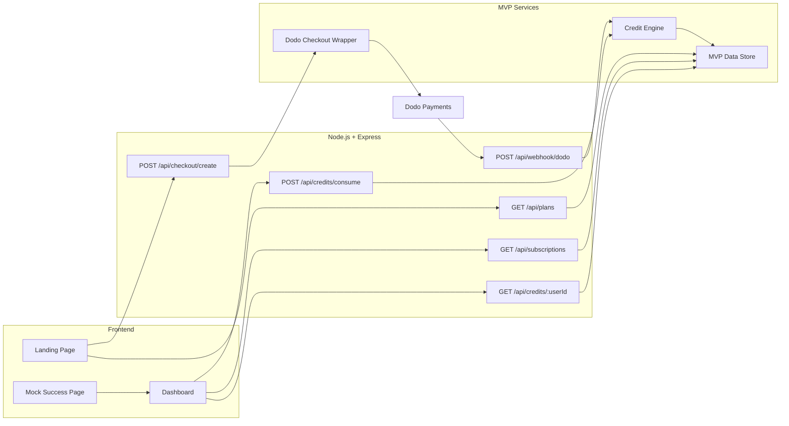
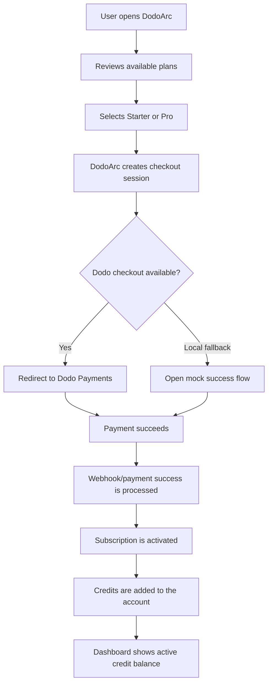
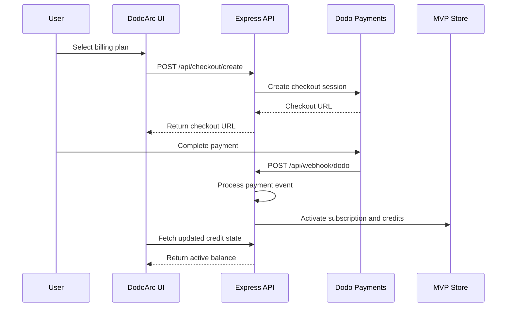
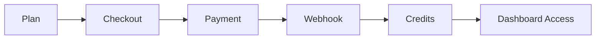

# DodoArc

DodoArc is a Milestone 1 MVP for a billing operating system for AI agent products. It proves the first commercial loop: a user chooses a plan, starts a Dodo Payments checkout, receives payment confirmation through a webhook, and gets application credits activated in the dashboard.

Built for the Dodo Payments track at the Solana Frontier hackathon, DodoArc focuses on a practical wedge for AI products: human-to-agent billing first, with a clean path toward agent-operated payment flows later.

## Milestone 1

Milestone 1 focuses only on the core billing foundation:

- Plan discovery for an AI agent product.
- Dodo Payments checkout creation.
- Local mock checkout fallback for development.
- Payment webhook handling.
- Credit activation after successful payment.
- Dashboard visibility for subscriptions and credits.
- Backend tests for credit and webhook behavior.

## Architecture



## Workflow Map



## Webhook Sequence



## Tech Stack

- Node.js
- Express
- Dodo Payments SDK/API wrapper
- Static HTML, CSS, and JavaScript
- Jest and Supertest

## Project Structure

```text
DodoArc/
├── public/
│   ├── index.html
│   ├── app.js
│   └── mock-success.html
├── src/
│   ├── config.js
│   ├── routes/
│   │   ├── checkout.js
│   │   ├── credits.js
│   │   ├── plans.js
│   │   ├── subscriptions.js
│   │   └── webhook.js
│   └── services/
│       ├── db.js
│       └── dodo.js
├── tests/
│   ├── credits.test.js
│   └── webhook.test.js
├── server.js
├── package.json
└── .env.example
```

## Environment

Create a `.env` file from `.env.example` and add Dodo test credentials.

```env
PORT=3000
BASE_URL=http://localhost:3000
FRONTEND_URL=http://localhost:3000

DODO_API_KEY=dodo_test_your_key
DODO_WEBHOOK_SECRET=whsec_your_secret
DODO_ENVIRONMENT=test_mode
```

Use test mode while developing. Never commit production API keys or webhook secrets.

## Run Locally

```bash
npm install
npm run dev
```

Open:

```text
http://localhost:3000
```

## Test

```bash
npm test
```

## Milestone 1 Outcome



DodoArc Milestone 1 demonstrates that an AI product can turn a successful Dodo Payments checkout into usable product credits with a simple, testable backend flow.
