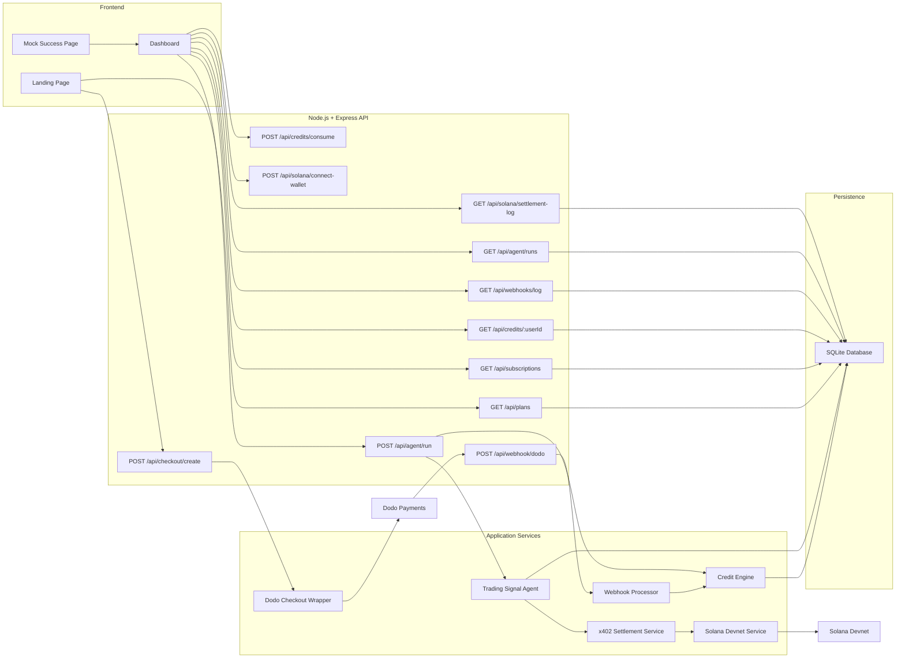
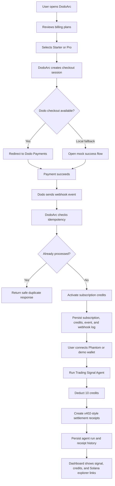
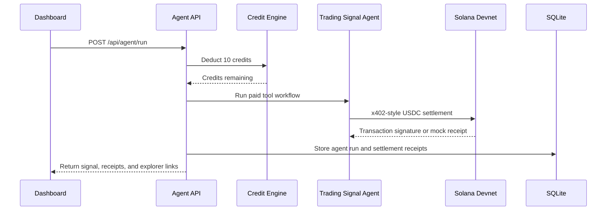

# DodoArc

DodoArc is a billing OS for AI agent products. It lets a user subscribe through Dodo Payments, activates credits after payment, and gives operators a dashboard for subscriptions, credit usage, webhook activity, agent runs, and Solana settlement receipts.

Built for the Dodo Payments track at the Solana Frontier hackathon, DodoArc starts with a practical wedge: human-to-agent billing first, with infrastructure that can support agent-operated payments.

## Milestone Status

### Milestone 1: Checkout and Credits

Milestone 1 proved the core billing loop:

- Plan discovery for an AI agent product.
- Dodo Payments checkout creation.
- Local mock checkout fallback for development.
- Payment webhook handling.
- Credit activation after successful payment.
- Dashboard visibility for subscription and credit state.
- Backend tests for credit and webhook behavior.

### Milestone 2: Persistent Billing Dashboard

Milestone 2 turned the MVP into a stronger product foundation:

- SQLite-backed persistence for users, subscriptions, events, webhook logs, and credit state.
- Dedicated landing page and authenticated-style dashboard surface.
- Webhook idempotency to prevent duplicate processing.
- Webhook processing logs for debugging and operational visibility.
- Solana settlement readiness endpoints for future stablecoin flows.
- Improved dashboard views for subscriptions, credits, events, webhooks, and settlement status.
- Expanded tests around webhook behavior and persistent billing state.

### Milestone 3: Agent Runs and x402 Settlement Receipts

Milestone 3 connects the billing foundation to the agent economy:

- Phantom wallet connect with demo wallet fallback for Solana devnet settlement routing.
- Demo Trading Signal Agent exposed through `POST /api/agent/run`.
- Credit deduction before each agent execution.
- Three paid tool calls per run, represented as x402-style USDC settlement receipts.
- Real Solana devnet transfer path when wallet credentials are configured.
- Mock settlement receipts when devnet credentials are absent, keeping the demo runnable.
- Persistent agent run history and settlement receipt storage in SQLite.
- Dashboard Agents view for running the agent, reviewing receipts, and opening Solana explorer links.
- Devnet setup helper for funding and checking the settlement wallet.

## Architecture



## Workflow Map



## Agent Settlement Sequence



## Tech Stack

- Node.js
- Express
- Dodo Payments SDK/API wrapper
- SQLite through `better-sqlite3`
- Solana Web3.js and SPL Token tooling
- Static HTML, CSS, and JavaScript
- Jest and Supertest

## Project Structure

```text
DodoArc/
├── public/
│   ├── index.html
│   ├── landing.js
│   ├── dashboard.html
│   ├── dashboard.js
│   └── mock-success.html
├── scripts/
│   └── setup-devnet.js
├── src/
│   ├── config.js
│   ├── routes/
│   │   ├── agent.js
│   │   ├── checkout.js
│   │   ├── credits.js
│   │   ├── plans.js
│   │   ├── solana.js
│   │   ├── subscriptions.js
│   │   ├── webhook.js
│   │   └── webhooks.js
│   └── services/
│       ├── agent.js
│       ├── db.js
│       ├── dodo.js
│       ├── solana.js
│       └── sqlite.js
├── tests/
│   ├── agent.test.js
│   ├── credits.test.js
│   └── webhook.test.js
├── server.js
├── package.json
└── .env.example
```

## Environment

Create a `.env` file from `.env.example` and add Dodo test credentials.

```env
PORT=3000
BASE_URL=http://localhost:3000
FRONTEND_URL=http://localhost:3000

DODO_API_KEY=dodo_test_your_key
DODO_WEBHOOK_SECRET=whsec_your_secret
DODO_ENVIRONMENT=test_mode

DB_PATH=./data/dodoarc.db
SOLANA_RPC_URL=https://api.devnet.solana.com
SOLANA_PRIVATE_KEY=
USDC_MINT_DEVNET=4zMMC9srt5Ri5X14GAgXhaHii3GnPAEERYPJgZJDncDU
SETTLEMENT_WALLET_PUBLIC_KEY=
X402_TOOL_PROVIDER_WALLET=
```

Use Dodo test mode while developing. Never commit production API keys or webhook secrets.

## Run Locally

```bash
npm install
npm run dev
```

Open:

```text
http://localhost:3000
```

Dashboard:

```text
http://localhost:3000/dashboard
```

## Test

```bash
npm test
```

## Current Outcome

```mermaid
flowchart LR
    Plan["Plan"] --> Checkout["Checkout"]
    Checkout --> Payment["Payment"]
    Payment --> Webhook["Idempotent Webhook"]
    Webhook --> Credits["Credits Activated"]
    Credits --> Agent["Agent Run"]
    Agent --> Settlement["x402 Settlement Receipt"]
    Settlement --> Persistence["SQLite Persistence"]
    Persistence --> Dashboard["Billing Dashboard"]
```



DodoArc now demonstrates a testable billing foundation for AI agent products: Dodo Payments checkout, webhook-based activation, durable billing records, credit-backed agent execution, x402-style Solana settlement receipts, and a dashboard for operational visibility.
